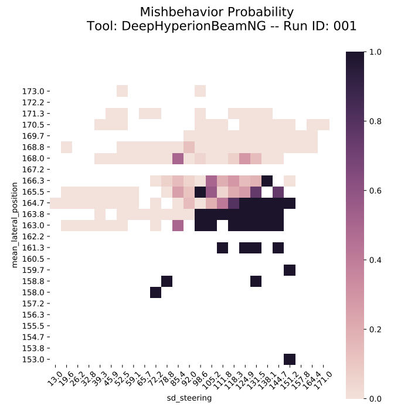
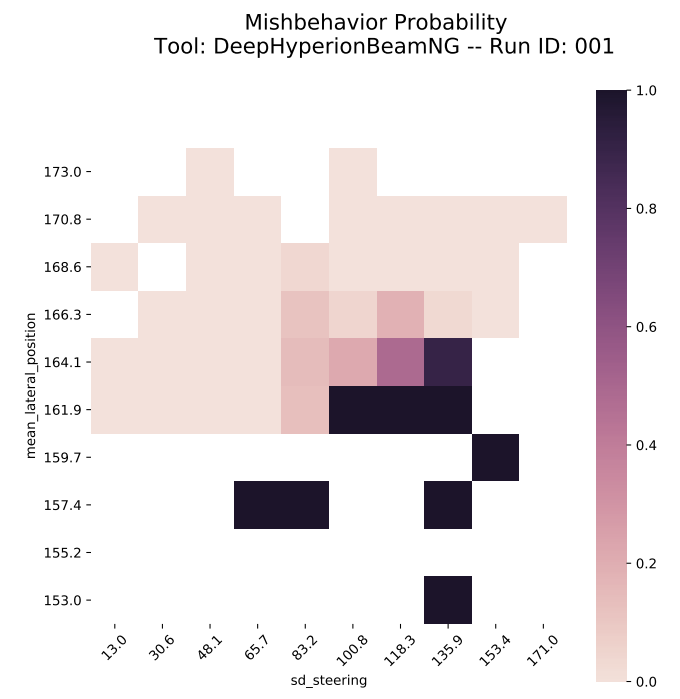

# DeepHyperion

DeepHyperion is a tool for generating test inputs and feature maps using illumination-search algorithm.


## DeepHyperion-MNIST ##
To set up the environment and run the DeepHyperion tool adapted to the handwritten digit classification case study, follow the instructions [here](/DeepHyperion-MNIST/README.md).


## DeepHyperion-BNG ##
To set up the environment and run the DeepHyperion tool adapted to the self-driving car case study, follow the instructions [here](/DeepHyperion-BNG/README.md). 


## Experimental Data and Scripts ##
To regenerate the results and plots reported in the paper, follow the instructions [here](/experiments/README.md) 


## Extra Use Case Scenarios ##
This section contains plausible scenarios on how DeepHyperion could be extended beyond the experiments performed in the paper.

### Scenario 1: Modify the intervals of the maps ###

This scenario shows that a map can be rescaled to the granularity defined by the user. This adjustment is particularly useful when the user wants to compare maps produced in different runs/configurations or by different tools.

As an example, you can configure _DeepHyperion-BeamNG_ to generate maps with _N_ (_N > 0_) bins for each feature. 
To do this, first run _DeepHyperion-BNG_ with predefined configuration. Then, as explained in [Generate Processed Data and Rescaled Maps](/DeepHyperion-BNG/report_generator) step 3, you can set the number of bins for each feature as follows:
```
python report_generator/app.py generate-map --feature sd_steering 13 171 <N> --feature mean_lateral_position 153 173 <N> .\logs\run_XXX
```
For example, you can set N = 25, which generates the following map:

<p align="center">
</p>


Or, you can set the N = 10, which generates the following map:


<p align="center">
</p>


### Scenario 2: Performing MNIST experiments with digits different from 5s ###

This scenario shows the applicability of the _DeepHyperion-MNIST_ on digit classes of MNIST different from the ones considered in the experimental evaluation, i.e. digit class "5".
As an example, you can configure _DeepHyperion-MNIST_ to generate inputs for digit class "6".
To do this, you should edit the parameter EXPECTED_LABEL in _DeepHyperion-MNIST/properties.py_ file as follows:
```
    EXPECTED_LABEL = int(os.getenv('DH_EXPECTED_LABEL', '6'))

```

### Scenario 3: Test a different DL model ###

This scenario shows the possibility of using trained models for _DeepHyperion-MNIST_ different from the one considered in the experimental evaluation.
As an example, you can configure _DeepHyperion-MNIST_ to use the alternative model `cnnClassifier.h5` which is already in _models_ folder.
To do this, you need to place the name of the new model in _DeepHyperion-MNIST/properties.py_ as follows:
```
    MODEL = os.getenv('DH_MODEL', 'models/cnnClassifier.h5')
```
Moreover you can test your own model. You can train a new model by running the following command:
```
python DeepHyperion-MNIST/train_model.py <YOUR_MODEL_NAME>
```
After the new model has been trained, you can place it in _DeepHyperion-MNIST/models_ folder, then edit the configuration in _DeepHyperion-MNIST/properties.py_ file as follows:
```
    MODEL = os.getenv('DH_MODEL', 'models/<YOUR_MODEL_NAME>.h5')
```
